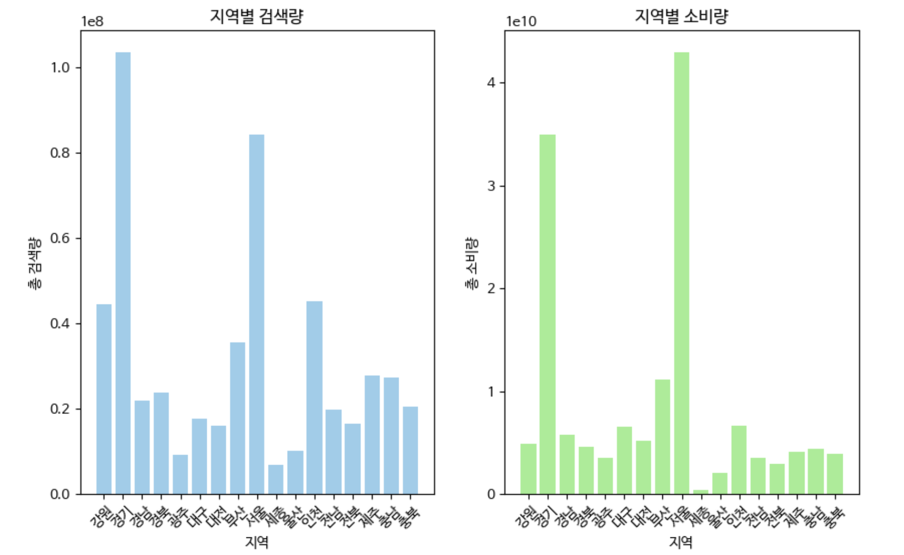
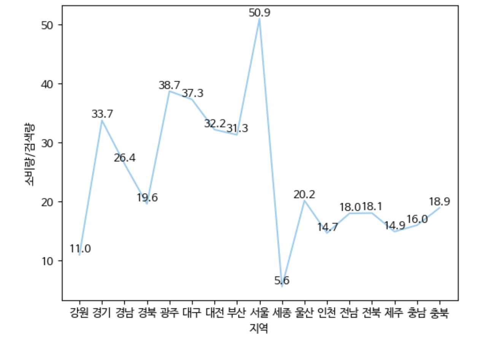
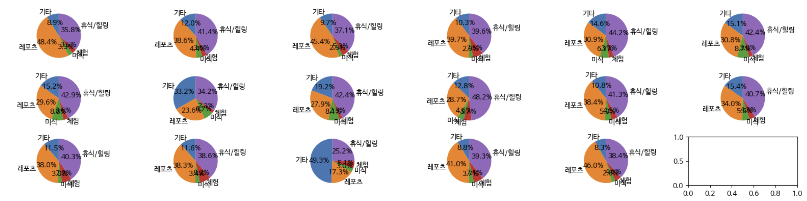

 # 🚀 TRAVELING DATA ANALYSTICS

> AI 이국종 팀이 수집한 데이터를 이용하여 DDA, EDA, CDA, ML의 과정을 수행
- 수행기간 : 20240415 - 
- 데이터 수집 : [한국관광데이터랩](https://datalab.visitkorea.or.kr/datalab/portal/loc/getAreaDataForm.do?SGG_CD=11#)

 ## 🐋 DDA
> 데이터 구조를 확인하고 형태를 정리

 data_attraction : 관광명소 검색량 

- 13,600 non-null
- 년도에 따라 관광명소 중에 중복되는 것이 있는지 확인
- rank가 무슨 의미인지 확인

|no|Variable|Definition|Key|Dtype|분석가 의견|
|--|--|--|--|--|--|
|1|_id|아이디||object||
|2|rank|랭크?||int64||
|3|attracton_name|관광명소 이름||object||
|4|address|주소||object||
|5|classiication|분류|'시장', '자연경관(하천/해양)', '콘도미니엄', '종교성지', '기타관광', '호텔', '수상레저스포츠', '교통시설', '복합관광시설', '기타문화관광지', '육상레저스포츠', '랜드마크관광', '테마공원', '역사유적지', '자연공원', '기타레저스포츠', '전시시설', '농/산/어촌체험', '자연경관(산)', '쇼핑몰', '백화점','도시공원', '공연시설', '대형마트', '웰니스관광', '캠핑', '레저스포츠시설', '모텔', '기타쇼핑시설', '기타숙박', '데이트코스', '펜션/민박', '역사유물', '자연생태', '자연관광(산)', '면세점', '한식','음식점기타', '카페/찻집', '전문음식', '간이음식', '외국식'|object|각 분류별로 관광명소 검색량을 알아낼 수 있어 유의미할 것으로 보임|
|6|attraction_search|검색량||int64|관광명소 검색량으로 가장 중요한 데이터|
|7|region|지역|'강원', '경기', '경남', '경북', '광주', '대구', '대전', '부산', '서울', '세종', '울산','인천', '전남', '전북', '제주', '충남', '충북'|object||
|8|std_year|년도|2020~2023|int64|해당 년도에 얼마나 검색되었는지 알 수 있음|

 data_concept_search : 월별 관광 테마 검색량 

|no|Variable|Definition|Key|Dtype|분석가 의견|
|--|--|--|--|--|--|
|1|_id|아이디||object||
|2|destinatinon_type|목적지 타입|전체, 숙박, 음식, 기타관광, 쇼핑, 레저스포츠|object|분류에 사용 가능|
|3|destination_search|검색량||int64|년/월 별로 다르기 때문에 상황에 따라 합할 필요성 있음|
|4|region|지역||object||
|5|std_year|년도||int64||
|6|std_month|월||int64|월별로 나눌 수 있음|
|7|std_year_month|년월|xxxxxx 형식|int64||

 data_consume : 분야별 소비량 

- 1177 non-null

|no|Variable|Definition|Key|Dtype|분석가 의견|
|--|--|--|--|--|--|
|1|_id|아이디||object||
|2|std_year|년도||int64||
|3|region|지역||object||
|4|consumption_amount|소비량||float64||
|5|industry_major_cate|대분류|'쇼핑업', '숙박업', '식음료업', '여가서비스업', '여행업', '운송업'|object||
|6|industry_middle_cate|중분류|'관광기념품', '레저용품쇼핑', '대형쇼핑몰', '면세점', '호텔', '콘도', '캠핑장/펜션', '기타숙박', '식음료', '관광유원시설', '골프장', '기타레저', '문화서비스', '스키장', '여행업', '수상운송', '렌터카', '육상운송', '항공운송', '카지노'|object||

 data_consume_transition : 소비 유형들의 월별 소비량 

- 5693 non-null

|no|Variable|Definition|Key|Dtype|분석가 의견|
|--|--|--|--|--|--|
|1|_id|아이디||object||
|2|industry_major_cate|대분류|'전체', '운송업', '여행업', '숙박업', '식음료업', '여가서비스업', '쇼핑업'|object||
|3|std_year_month|년월|xxxxxx 형식|int64||
|4|std_year|년도||int64||
|5|std_month|월||int64|월별로 나눌 수 있음|
|6|consumption_amount|소비량||int64||
|7|region|지역||object||

 data_trend_search : 월별 여행 트렌드 검색량 

- 4080 non-null

|no|Variable|Definition|Key|Dtype|분석가 의견|
|--|--|--|--|--|--|
|1|_id|아이디||object||
|2|region|지역||object||
|3|std_year_month|년월|xxxxxx 형식|int64||
|4|std_year|년도||int64||
|5|std_month|월||int64|월별로 나눌 수 있음|
|6|tour_trend|투어유형|'레포츠', '휴식/힐링', '기타', '미식', '체험'|object||
|7|num_mention|검색량||int64||

 data_tour_NLP_train : 네이버 블로그 제목 

- 10000 non-null
- [라벨링 참고](https://docs.google.com/spreadsheets/d/1WCxhauSWOAOyteTYYRZVgUhpZjO9dhXZ/edit#gid=2013088085)

|no|Variable|Definition|Key|Dtype|분석가 의견|
|--|--|--|--|--|--|
|1|_id|아이디||object||
|2|concept|컨셉|1:문화,2:레저, 3:역사, 4:음식, 5:자연, 6:힐링|int64|직접 라벨링한 것이므로 해당 부분에 대한 수정 필요할 수도 있음|
|3|season|계절|1:봄, 2:여름, 3:가을, 4:겨울|int64|직접 라벨링한 것이므로 해당 부분에 대한 수정 필요할 수도 있음|
|4|review_text|블로그 제목||object|raw_data이므로 보존|
|5|지역|지역|'울산', '전북', '대전', '경기', '전남', '제주', '대구', '강원', '광주', '경남', '서울', '부산', '경북', '인천', '충남', '충북', '세종'|object||
|6|review_text_clean|동사, 명사만 찾아낸 것||object||

## 🐋 EDA

 데이터 분석 목적

- 각 지역별 소비량을 늘릴 수 있는 방안 탐색
- 각 지역별로 어떤 여행코스를 추천해줘야 하는지 마케팅 전략 수립

각 지역별 여행 검색량과 소비량을 비교 

    
    

- 검색량 대비 소비량이 적은 순 : 세종 < 강원 < 인천 < 제주 < 충남 < 전남 < 전북 < 충북 < 경북 < 울산 < 경남 < 부산 < 대전 < 경기 < 대구 < 광주 < 서울
- 검색량 큰 순 : 경기 > 서울 > 인천 > 강원 > 부산 > 제주 > 충남 > 경북 > 경남 > 충북 > 전남 > 대구 > 전북 > 대전 > 울산 > 광주 > 세종
- 검색량이 큰 지역 중 검색량과 소비량의 차이가 상대적으로 큰 지역 : 강원, 인천
- 검색량이 적은 지역 중 검색량과 소비량의 차이가 적은 지역 : 광주, 대구, 대전
- 검색량이 적은 지역 중 검색량과 소비량의 차이가 큰 지역 : 세종, 울산, 전북, 전남

 
검색량이 큰 지역 중 검색량과 소비량의 차이가 상대적으로 큰 지역 : 강원, 인천 

### 가설0 : 각 지역에서 소비하게 되는 컨텐츠가 한정적이다

- 제주도를 제외하면 소비 컨텐츠 차이는 거의 없음
- 가설 기각

### 가설1 : 서울 근교 여행(강원, 인천)은 가볍게 검색하지만 실제로 가지는 않는다
- 필요 데이터 : 방문, 숙박/체류 관련 데이터
- [방문데이터_한국관광데이터랩](https://datalab.visitkorea.or.kr/datalab/portal/bda/getMetcoAna.do)
- 채택하는 경우 : 유입량은 많기 떄문에 해당 지역을 검색했을 때 관련 프로모션 제공 혹은 가볍게 다녀올 수 있는 여행코스 추천

### 가설2 : 서울 근교 여행은 가성비를 따진다
- 필요 데이터 : 인스타그램 해시태그(ex.#가성비)
- 채택하는 경우 : 해당 지역을 검색하는 경우 가성비가 좋은 여행 코스를 추천

 
검색량이 적은 지역 중 검색량과 소비량의 차이가 적은 지역 : 광주, 대구, 대전

### 가설0 : 검색량을 늘릴 수 있다면 소비량도 자연스럽게 늘어날 것이다

- 가설 채택 시 : 검색량 늘릴 수 있는 방안 모색

 
검색량이 적은 지역 중 검색량과 소비량의 차이가 큰 지역 : 세종, 울산, 전북, 전남

- 검색량이 적을 뿐만 아니라 실제로 소비량이 적기 때문에 '교통편'에 대한 정보가 필요함

## 🐋 CDA

 검색량과 소비량의 상관관계 분석 

- 두 항목이 비정규분포를 따르므로 spearmanr 이용
- correlation : 0.78 , p-value = 0.0002 -> 귀무가설 기각
- 검색량과 소비량은 상관관계가 있다.

## 🐋 결론

 필요 데이터 

- 한국관광데이터 내 방문, 숙박관련 데이터
- 인스타그램 해시태그 데이터
- 교통편 데이터
- 지역별 액티비티 수와 선호도

